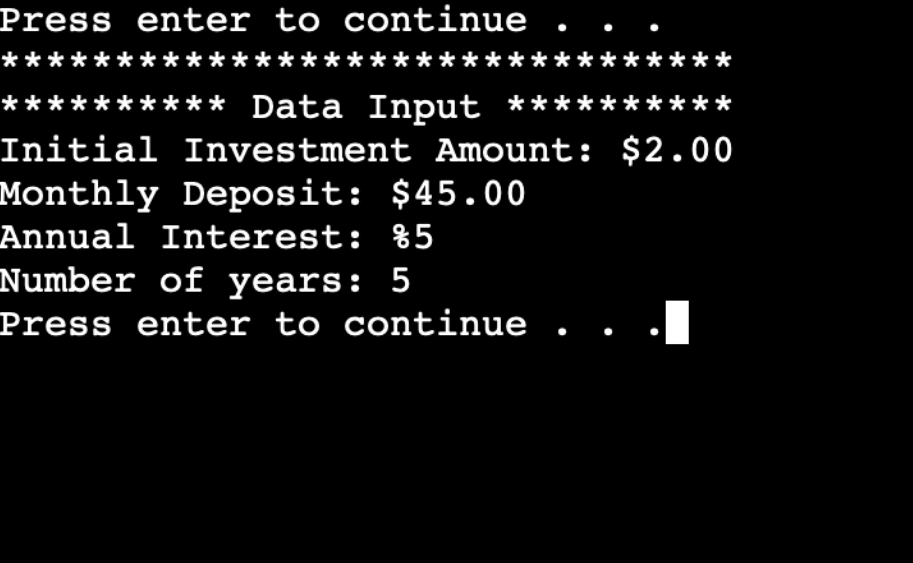
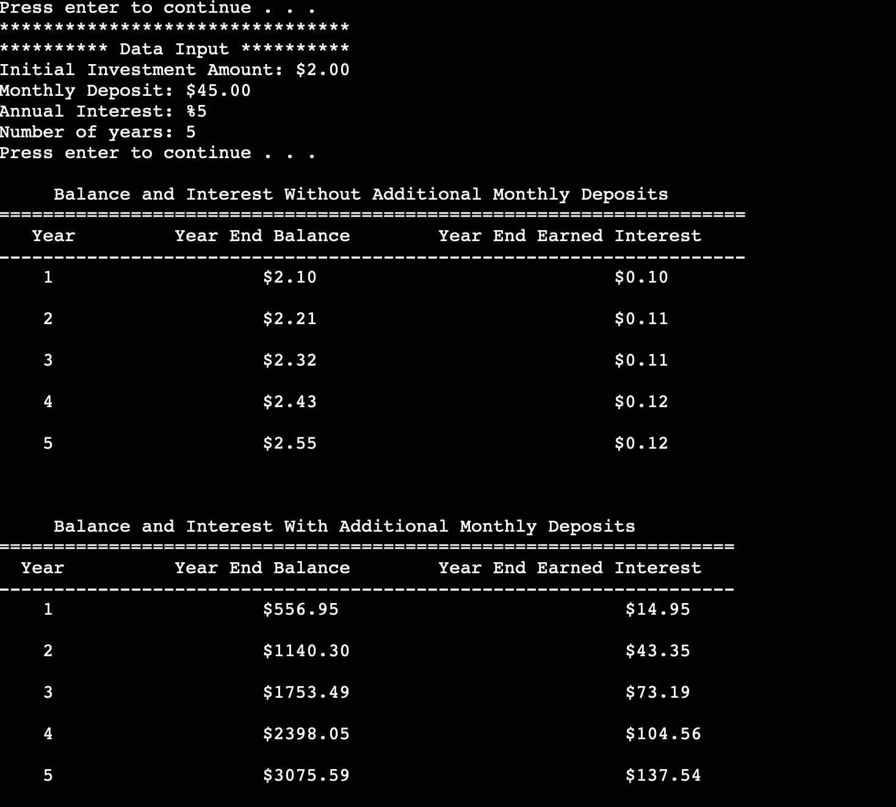
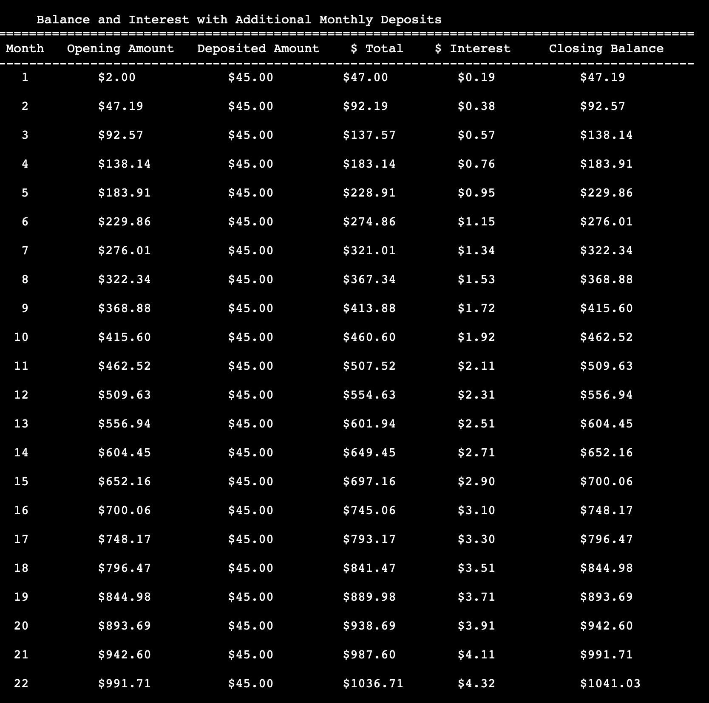

# Banking-App

Summarize the project and what problem it was solving.

The initial focus of this project is on investing and compound interest. This program allows users to see how their investments will grow over time. The screen displays the following informations: 

• Initial Investment Amount: The starting amount of your investment (a positive real
number) 
• Monthly Deposit: The amount you plan to contribute to the growth of your investment
each month (a positive real number) 
• Annual Interest (Compounded): Interest that is added to the principal sum of your
investment and its previously accumulated interest (interest on interest and principal) 
• Number of Years: The number of years your investment has to grow  
• A way to see the data (for example: “Press enter to continue…”)  

What did you do particularly well?

Where could you enhance your code? How would these improvements make your code more efficient, secure, and so on?
Which pieces of the code did you find most challenging to write, and how did you overcome this? What tools or resources are you adding to your support network?
What skills from this project will be particularly transferable to other projects or course work?
How did you make this program maintainable, readable, and adaptable?

